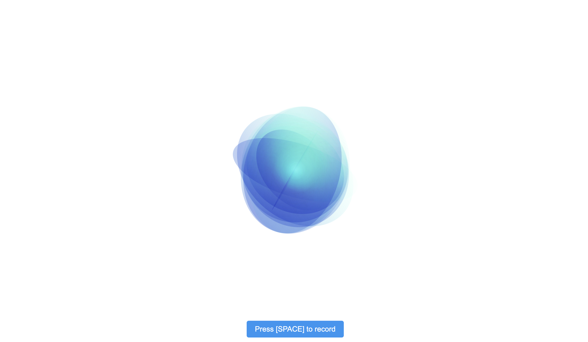
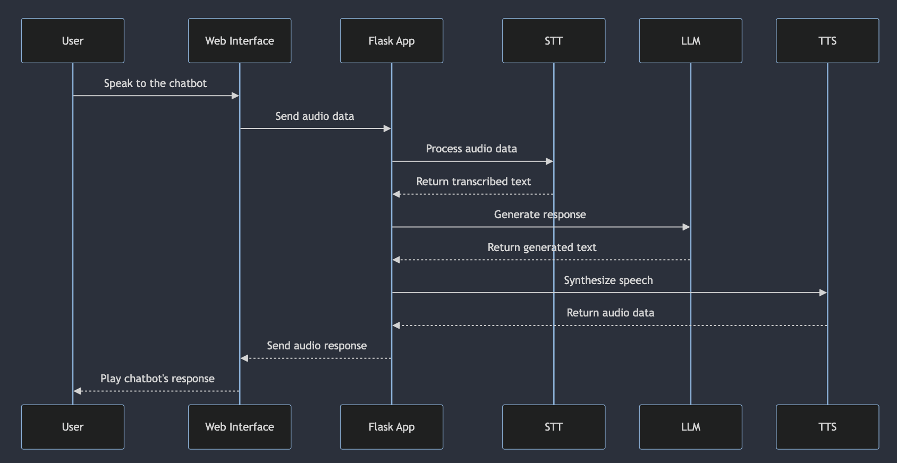

# 🎙️🤖 Simple Real-time Conversational AI with Whisper, Groq, and ElevenLabs 🚀

Discover a flexible, open-source framework for creating real-time conversational AI using Whisper, Groq, and ElevenLabs. This easy-to-use toolkit enables developers to build voice-driven chatbots with a focus on simplicity and extensibility. Embrace the power of natural, spoken conversation and move beyond the constraints of text-based interfaces.
This framework's straightforward, modular architecture allows developers of all skill levels to quickly create and customize their own conversational AI applications. By leveraging cutting-edge technologies and providing a clear, well-documented structure, this project aims to make voice-based AI accessible to a wider audience of developers.

## 🌟 Key Features

- 🎙️ Real-time voice input and output for truly immersive conversational experiences
- 🧩 Modular architecture for easy integration of STT, LLM, and TTS components
- 🔧 Highly configurable and adaptable to your unique requirements
- 🌐 Includes a sample web interface for rapid deployment and testing
- 🎭 Customizable persona and conversational style through editable prompt templates
- 🌈 Compatible with various cutting-edge AI models and libraries (Whisper, Faster Whisper, Groq, Anthropic, ElevenLabs, Azure TTS, and more)

## 🚀 Getting Started

1. Clone the repository: `git clone https://github.com/your-username/real-time-conversational-ai.git`
2. Install the required dependencies: `pip install -r requirements.txt`
3. Configure your API keys in the `.env` file (refer to `sample.env` for the required keys)
4. Customize your chatbot's persona and conversational style by editing the prompt template in `prompts/`
5. Start the application: `bash run.sh`
6. Open your web browser and navigate to `http://localhost:5000` to converse with your real-time conversational AI!

## 🏗️ Modular Architecture

This Real-time Conversational AI framework boasts a highly modular architecture, allowing you to mix and match components to suit your needs:

- `app.py`: The main Flask application that orchestrates the STT, LLM, and TTS components
- `stt/`: Contains the speech-to-text module, supporting Whisper and Faster Whisper
- `llm/`: Houses the language modeling module, accommodating Groq and Anthropic
- `tts/`: Includes the text-to-speech module, offering ElevenLabs, ElevenLabs Streaming, and Azure TTS
- `templates/`: Contains the sample HTML template for the web interface
- `prompts/`: Stores the prompt templates for the LLM, defining your chatbot's persona and conversational style

## 🔀 Sequence Diagram

## 🙌 Contributing

We welcome contributions from the developer community to help expand the capabilities of this Real-time Conversational AI framework. Submit a pull request or open an issue on the GitHub repository to join the project and shape the future of conversational AI!

## 📄 License

This project is licensed under the MIT License. See the `LICENSE` file for more information.

## 🙏 Acknowledgments

This Real-time Conversational AI framework is built upon the remarkable achievements of developers and researchers in the fields of AI, speech recognition, and speech synthesis. We express our deepest gratitude to the creators of the various AI models and libraries that make this project possible, including Whisper, Groq, ElevenLabs, and more.

Embrace the power of voice and revolutionize the way we interact with machines using this Real-time Conversational AI framework! 🎙️✨